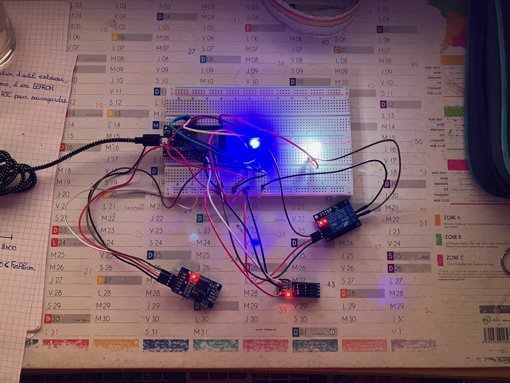

# Automatic Watering

## Photos

## Pin Management

| Function | Pin ESP32 | Pin device |
|--|--|--|
| Blue for Led | GPIO12 | Blue |
| Green for Led | GPIO14 | Green |
| +3v3 for Led | 3v3 | + (Biggest) |
| Red for Led | GPIO27 | Red |
| SCL for DS3231 | GPIO22 | SCL |
| SDA for DS3231 | GPIO21 | SDA |
| VCC for DS3231 | 3v3 | VCC |
| GND for DS3231 | GND | GND |
| SDA for Relay | GPIO26 | S |
| VCC for Relay | 3v3 | + |
| GND for Relay | GND | - |
| SCL for EEPROM | GPIO22 | SCL |
| SDA for EEPROM | GPIO21 | SDA |
| VCC for EEPROM | 3v3 | VCC |
| GND for EEPROM | GND | GND |

## External dependencies

Use of mutiple libraries :

- AnodeLEDRGB : <https://git.teissem.fr:13443/Electronique/test_led_rgb>
- ColorLEDRGB : <https://git.teissem.fr:13443/Electronique/test_led_rgb>
- ExternalEEPROM : <https://git.teissem.fr:13443/Electronique/test_external_eeprom>
- FullTime : <https://git.teissem.fr:13443/Electronique/test_rtc_ds3231>
- RealTimeClockDS3231 : <https://git.teissem.fr:13443/Electronique/test_rtc_ds3231>

## Project class definition

- DayAlarm : Represents an alarm, selected by the time of the day and the duration in minutes
- EEPROMMemoryManager : Permits to read/write table of DayAlarm, number of alarms and state in EEPROM 
